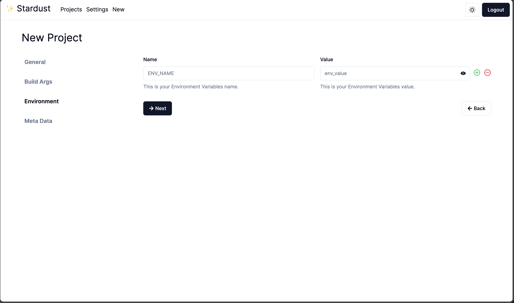
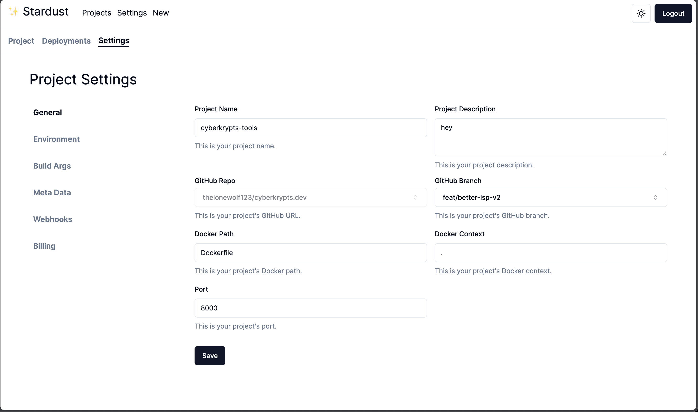

# Startdust.app: container provision engine

Startdust.app is a powerful container provision engine built with Node.js, TypeScript, MongoDB, Redis and Pulumi. It allows you to easily manage and orchestrate containers in your infrastructure, providing a seamless experience for containerized applications.

## Features

-   **Easy to use**: Startdust.app is built with simplicity in mind. It's easy to use and easy to deploy.
-   **scalable**: Startdust.app is built to scale. It can handle thousands of containers with ease.
-   **Secure**: Startdust.app is built with security in mind. It uses the latest security standards and best practices.
-   **Open source**: Startdust.app is open source and free to use. You can contribute to the project and make it better.

## Getting started

### Prerequisites

-   Node.js
-   MongoDB
-   Redis
-   Pulumi
-   RabbitMQ

### Installation

1. Clone the repo

```sh
git clone https://github.com/thelonewolf123/Startdust.app.git
```

1. Install NPM packages for pulumi

```sh
cd infra && yarn install
```

1. Deploy on aws

```sh
yarn infra:up
```

### Tear down

```sh
yarn infra:down
```

### Architecture


## Preview

Here are some screenshots of the Stardust.app:

|              Step 1               |              Step 2               |
| :-------------------------------: | :-------------------------------: |
|  |  |

|              Step 3               |              Step 4               |
| :-------------------------------: | :-------------------------------: |
|  |  |

|               Project               |               Settings                |
| :---------------------------------: | :-----------------------------------: |
|  |  |

|                Deployment                 |
| :---------------------------------------: |
|  |
