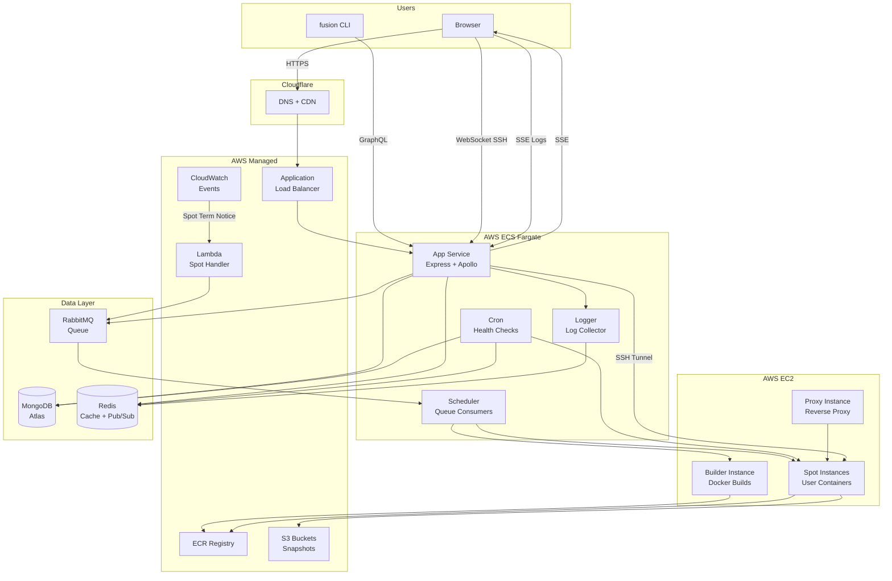
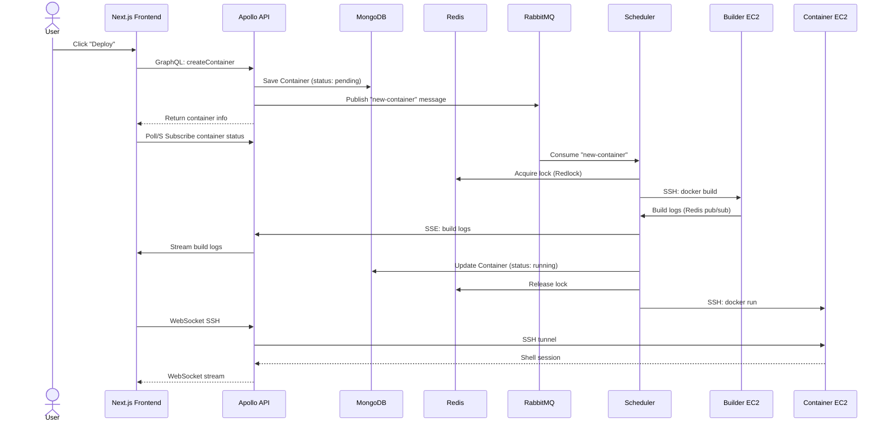
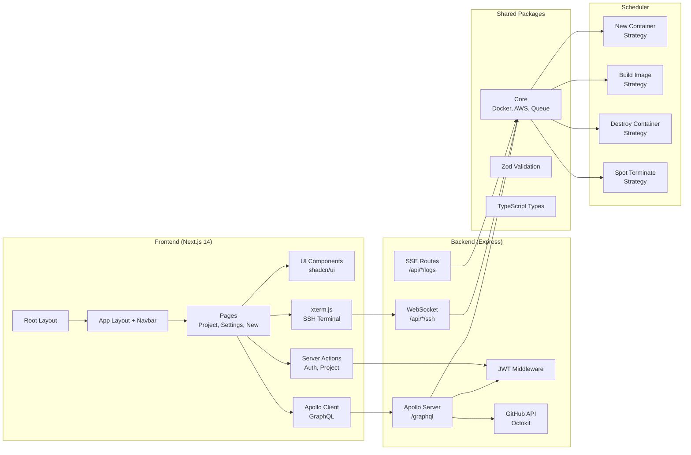

# System Architecture

## High-Level Architecture

```mermaid
graph TB
    subgraph "Users"
        B[Browser]
        CLI[fusion CLI]
    end

    subgraph "Cloudflare"
        DNS[DNS + CDN]
    end

    subgraph "AWS ECS Fargate"
        App[App Service<br/>Express + Apollo]
        Sched[Scheduler<br/>Queue Consumers]
        Cron[Cron<br/>Health Checks]
        Logger[Logger<br/>Log Collector]
    end

    subgraph "AWS EC2"
        Builder[Builder Instance<br/>Docker Builds]
        Proxy[Proxy Instance<br/>Reverse Proxy]
        Spot[Spot Instances<br/>User Containers]
    end

    subgraph "AWS Managed"
        ECR[ECR Registry]
        S3[S3 Buckets<br/>Snapshots]
        CW[CloudWatch<br/>Events]
        Lambda[Lambda<br/>Spot Handler]
        ALB[Application<br/>Load Balancer]
    end

    subgraph "Data Layer"
        MongoDB[(MongoDB<br/>Atlas)]
        Redis[(Redis<br/>Cache + Pub/Sub)]
        RMQ[RabbitMQ<br/>Queue]
    end

    B -->|HTTPS| DNS
    CLI -->|GraphQL| App
    DNS --> ALB
    ALB --> App
    
    App --> MongoDB
    App --> Redis
    App --> RMQ
    
    RMQ --> Sched
    Sched --> Builder
    Sched --> Spot
    
    Cron --> MongoDB
    Cron --> Spot
    Cron --> Redis
    
    Logger --> Redis
    App --> Logger
    
    Proxy --> Spot
    
    CW -->|Spot Term Notice| Lambda
    Lambda --> RMQ
    
    B -->|WebSocket SSH| App
    App -->|SSH Tunnel| Spot
    B -->|SSE Logs| App
    App -->|SSE| B
    
    Builder --> ECR
    Spot --> ECR
    Spot --> S3
```

## Request Flow: Deploy a Container

```mermaid
sequenceDiagram
    actor U as User
    participant F as Next.js Frontend
    participant API as Apollo API
    participant DB as MongoDB
    participant R as Redis
    participant Q as RabbitMQ
    participant S as Scheduler
    participant B as Builder EC2
    participant C as Container EC2

    U->>F: Click "Deploy"
    F->>API: GraphQL: createContainer
    API->>DB: Save Container (status: pending)
    API->>Q: Publish "new-container" message
    API-->>F: Return container info
    F->>API: Poll/S Subscribe container status
    
    Q->>S: Consume "new-container"
    S->>R: Acquire lock (Redlock)
    S->>B: SSH: docker build
    B->>S: Build logs (Redis pub/sub)
    S->>API: SSE: build logs
    API->>F: Stream build logs
    
    S->>DB: Update Container (status: running)
    S->>R: Release lock
    S->>C: SSH: docker run
    
    F->>API: WebSocket SSH
    API->>C: SSH tunnel
    C-->>API: Shell session
    API-->>F: WebSocket stream
```

## Component Architecture

```mermaid
graph LR
    subgraph "Frontend (Next.js 14)"
        Layout[Root Layout]
        AppLayout[App Layout + Navbar]
        Pages[Pages<br/>Project, Settings, New]
        Components[UI Components<br/>shadcn/ui]
        Apollo[Apollo Client<br/>GraphQL]
        ServerActions[Server Actions<br/>Auth, Project]
        Terminal[xterm.js<br/>SSH Terminal]
    end

    subgraph "Backend (Express)"
        JWT[JWT Middleware]
        GQL[Apollo Server<br/>/graphql]
        SSE[SSE Routes<br/>/api/*/logs]
        WS[WebSocket<br/>/api/*/ssh]
        GH[GitHub API<br/>Octokit]
    end

    subgraph "Shared Packages"
        Core[Core<br/>Docker, AWS, Queue]
        Schema[Zod Validation]
        Types[TypeScript Types]
    end

    subgraph "Scheduler"
        NC[New Container<br/>Strategy]
        BI[Build Image<br/>Strategy]
        DC[Destroy Container<br/>Strategy]
        ST[Spot Terminate<br/>Strategy]
    end

    Layout --> AppLayout
    AppLayout --> Pages
    Pages --> Components
    Pages --> Apollo
    Pages --> Terminal
    Pages --> ServerActions
    Apollo --> GQL
    ServerActions --> JWT
    Terminal --> WS
    SSE --> Core
    WS --> Core
    GQL --> Core
    GQL --> JWT
    GQL --> GH
    Core --> NC
    Core --> BI
    Core --> DC
    Core --> ST
```
