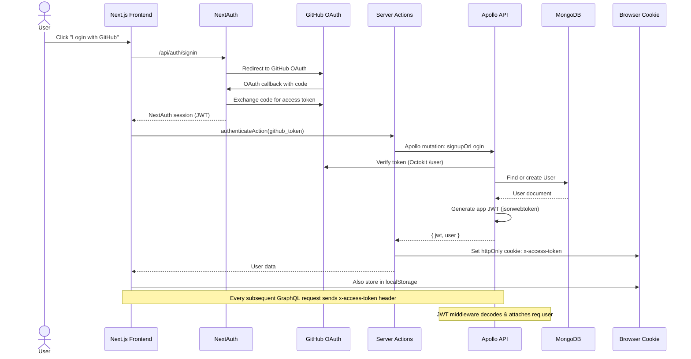

# Authentication & Authorization

## Auth Flow



## Token Management

| Token | Location | Purpose |
|-------|----------|---------|
| NextAuth JWT | httpOnly cookie | NextAuth session management |
| App JWT | httpOnly cookie + localStorage | GraphQL API authentication |
| GitHub Token | MongoDB (user.github_access_token) | GitHub API calls via Octokit |

## Express JWT Middleware

Every request to the backend passes through JWT middleware that:

1. Extracts token from `x-access-token` header
2. Verifies and decodes the JWT
3. Looks up the user in MongoDB
4. Checks JWT version counter (allows forced logout)
5. Attaches `req.user` for downstream handlers

```typescript
// Simplified middleware structure
app.use(async (req, res, next) => {
  const token = req.headers['x-access-token'];
  const decoded = jwt.verify(token, JWT_SECRET);
  const user = await User.findById(decoded.id);
  
  if (user.count !== decoded.count) {
    return res.status(401).send('Token revoked');
  }
  
  req.user = user;
  next();
});
```

## GraphQL Resolver Context

```typescript
interface Context {
  user: User;          // Authenticated user document
  res: Response;       // Express response (for cookies)
  publishers: Publisher[];  // Redis publishers
}
```

## Server Actions

The frontend uses Next.js Server Actions for auth operations:

| Action | Purpose |
|--------|---------|
| `authenticateAction` | Exchange GitHub token for app JWT, set cookies |
| `logoutAction` | Clear auth cookies |
| `getAccessToken` | Read JWT from cookie for client-side use |
