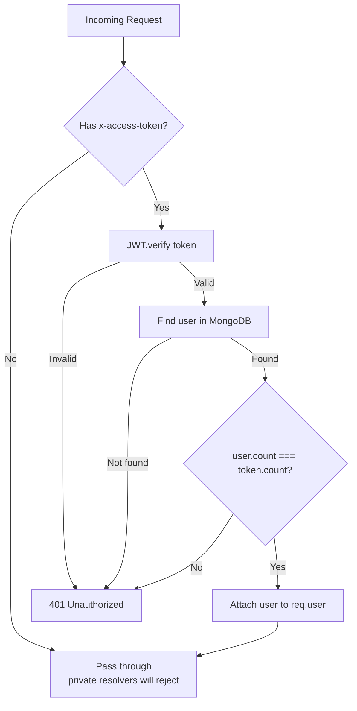

# Middleware & Auth

## JWT Authentication Middleware

Applied globally to all requests. Located in `packages/backend/index.ts`:



## Project Ownership Middleware

Located in `packages/backend/library/index.ts`. Verifies the requesting user owns the project being accessed.

## Rate Limiting & Validation

- **Zod schemas** in `packages/schema/index.ts` validate all queue message payloads
- Input validation in GraphQL resolvers uses TypeScript + GraphQL type system

## Middleware Stack

```
Request
  │
  ├── CORS (express cors)
  ├── Body parser (express json)
  ├── JWT verification (custom)
  │     └── Sets req.user
  ├── Apollo Server middleware
  │     ├── Auth check (in context function)
  │     └── Resolver execution
  └── Response
```
