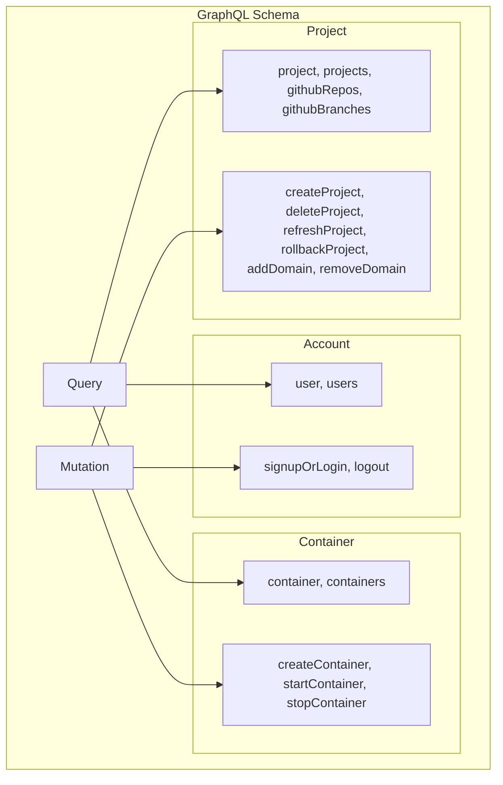
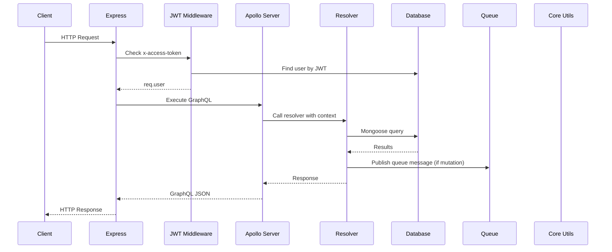

# Backend Overview

## Architecture

The backend is an Express server with Apollo Server 4 mounted at `/graphql`. It includes REST routes for real-time features (SSE logs, WebSocket SSH) and webhooks.

```
packages/
├── backend/           # Express + Apollo Server
│   ├── index.ts       # Server entry, middleware, route mounting
│   ├── database/      # MongoDB models & connection
│   ├── resolvers/     # GraphQL resolvers (Account, Container, Project)
│   ├── publisher/     # Redis pub/sub for logs
│   ├── library/       # GitHub API helpers, middleware
│   └── routes/        # SSE logs, WebSocket SSH, webhooks
├── core/              # Shared utilities
│   ├── aws/           # EC2, ECR, S3, SSM clients
│   ├── docker.ts      # Dockerode over SSH
│   ├── queue.ts       # RabbitMQ manager
│   └── redis.ts       # Redis + Redlock + Lua runner
├── schema/            # Zod validation schemas
└── types/             # Shared TypeScript types
```

## Server Entry Point

The main server at `packages/backend/index.ts`:

1. Connects to MongoDB, Redis, RabbitMQ
2. Sets up Apollo Server with merged typeDefs + resolvers
3. Mounts JWT middleware globally
4. Registers REST routes (SSE, WebSocket, webhooks)
5. Starts Express on port 4000

```typescript
// Conceptual structure
const app = express();
const server = new ApolloServer({
  typeDefs: mergeTypeDefs([AccountType, ContainerType, ProjectType]),
  resolvers: mergeResolvers([AccountResolvers, ContainerResolvers, ProjectResolvers]),
  context: async ({ req }) => ({
    user: req.user,
    res: req.res,
    publishers: redisPublishers,
  }),
});

app.use(jwtMiddleware);
app.use('/graphql', expressMiddleware(server));
app.use('/api', logsRouter, sshRouter, webhookRouter);
```

## GraphQL Schema Structure



## Request Lifecycle


