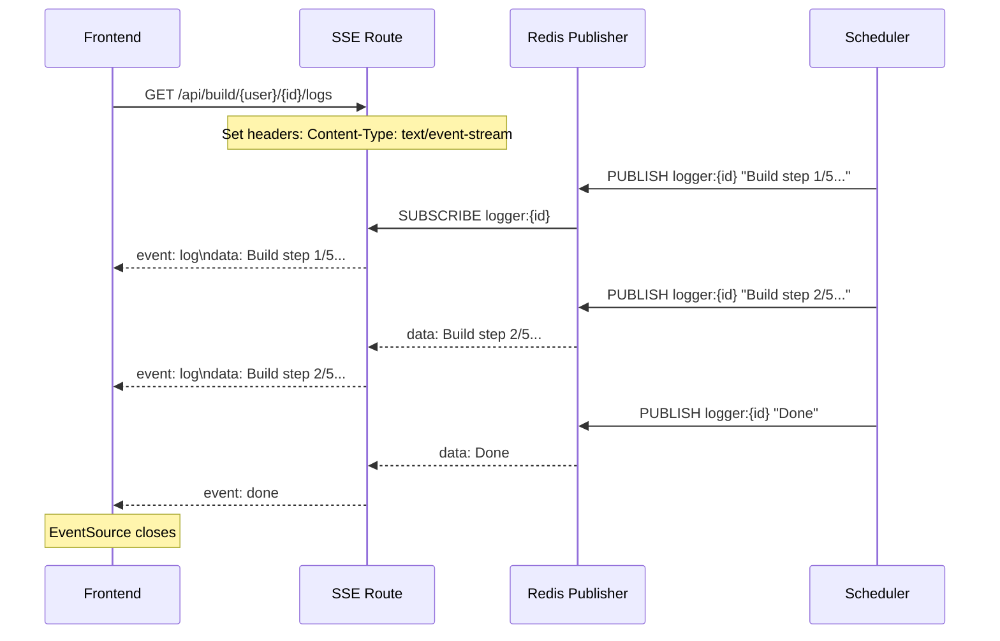
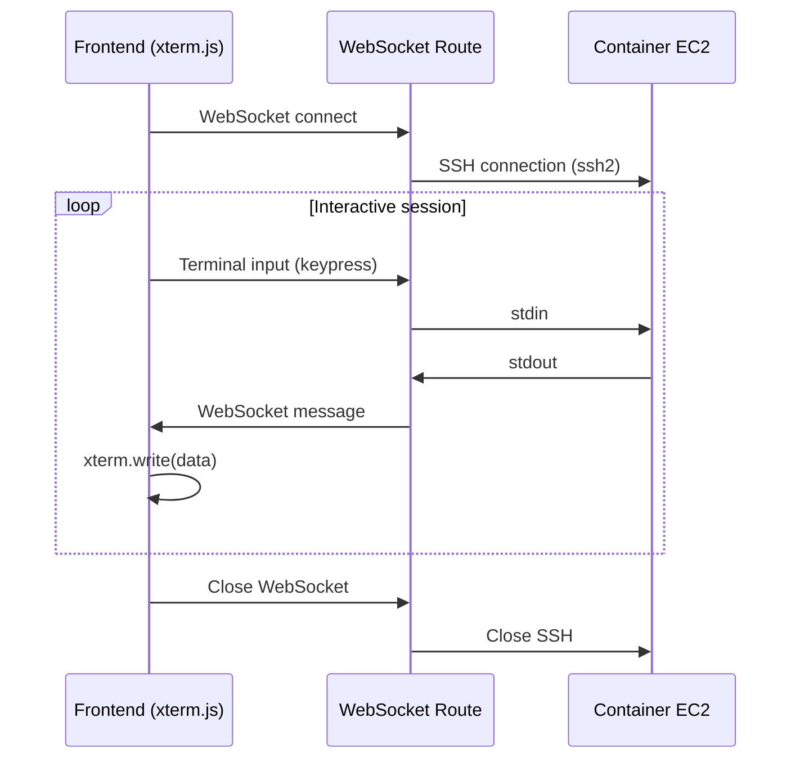

# REST Routes

Beyond GraphQL, the backend exposes several REST routes for real-time and webhook functionality:

## SSE Log Streaming

```
GET /api/build/:username/:id/logs
GET /api/container/:username/:id/logs
```

These endpoints provide **Server-Sent Events (SSE)** for streaming build and container logs in real-time.



## WebSocket SSH

```
WS /api/container/:username/:id/ssh
```

Provides an interactive shell into running containers from the browser.



## GitHub Webhook

```
POST /api/webhook/:username/:id/trigger
```

Receives GitHub push events and triggers automatic container rebuild:

1. Verify webhook secret
2. Look up project and current container
3. Publish `build-container` queue message
4. Return 200 OK

## Key Backend Libraries

| Library | File | Purpose |
|---------|------|---------|
| Dockerode | `packages/core/docker.ts` | Docker client over SSH to EC2 |
| Queue | `packages/core/queue.ts` | RabbitMQ channel + queue setup |
| Redis | `packages/core/redis.ts` | Client, Redlock, Lua script runner |
| EC2 | `packages/core/aws/ec2.aws.ts` | AWS EC2 SDK client |
| ECR | `packages/core/aws/ecr.aws.ts` | AWS ECR SDK client |
| S3 | `packages/core/aws/s3.aws.ts` | AWS S3 SDK client |
| SSM | `packages/core/aws/ssm.aws.ts` | AWS SSM Parameter Store client |
| GitHub | `packages/backend/library/github.ts` | Octokit REST client |
