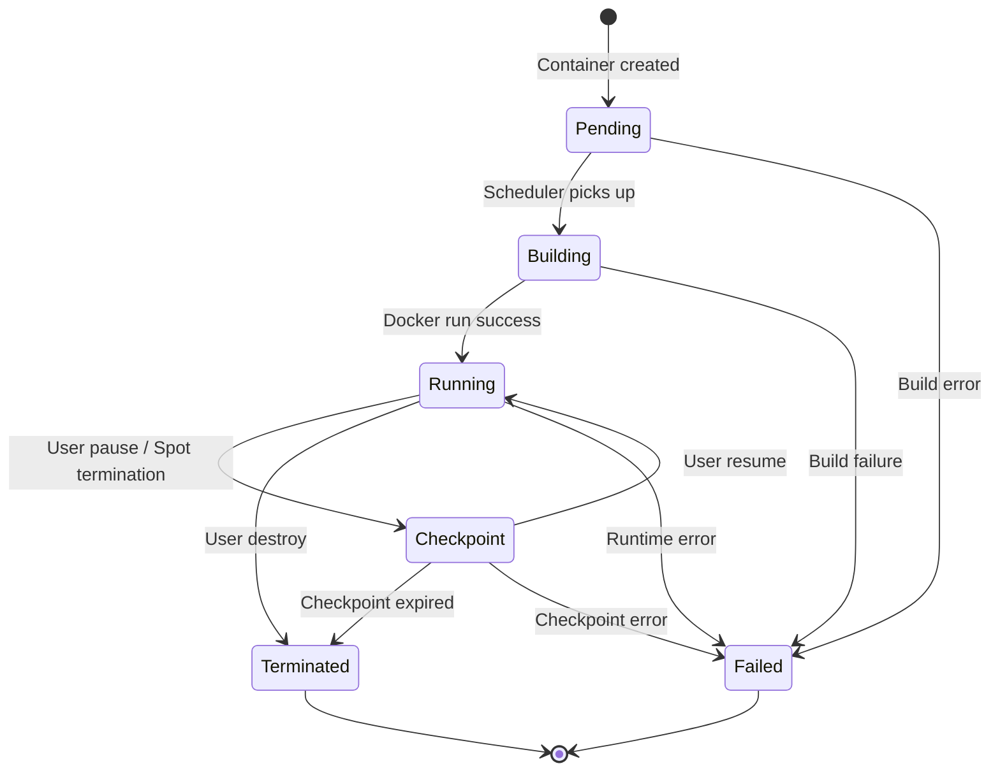
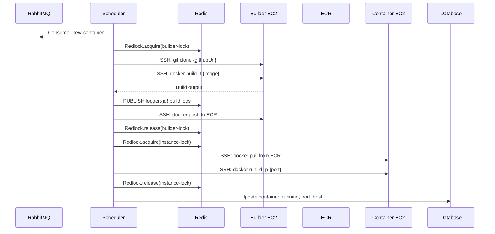

# Container Lifecycle

## State Machine



## Lifecycle Phases

### 1. Pending

Container record is created in MongoDB with `status: pending`. A message is published to the `new-container` RabbitMQ queue.

### 2. Building

The Scheduler's `NewContainerStrategy` picks up the message:

1. Acquire a distributed lock on the builder EC2 instance (Redlock)
2. Pull source code from GitHub (via git clone)
3. Build Docker image on the builder instance
4. Push image to ECR
5. Publish build logs to Redis pub/sub (`logger:*` channel)
6. Release the lock

### 3. Running

Once the image is ready:

1. The `BuildImageStrategy` picks a target EC2 instance
2. Pull the image from ECR onto the instance
3. Start the container via Docker (Dockerode over SSH)
4. Register with the reverse proxy
5. Update MongoDB: `status: running`, assign port, instance info

### 4. Checkpointing

When pausing or handling a spot termination:

1. `docker checkpoint create` the running container
2. Upload checkpoint to S3
3. Destroy the running container
4. Set `status: checkpoint` in MongoDB

On resume:
1. Download checkpoint from S3
2. `docker start --checkpoint` on a new instance
3. Re-register with reverse proxy
4. Set `status: running`

### 5. Terminated

Container is permanently stopped:

1. `docker stop` + `docker rm`
2. Optionally push final checkpoint to S3
3. Remove from reverse proxy
4. Set `status: terminated` in MongoDB

## Deployment Flow



## Container Model

```typescript
interface Container {
  containerSlug: string;       // "username/project-name"
  image: string;               // ECR image URI
  status: ContainerStatus;     // pending | running | checkpoint | terminated | failed
  containerId: string;         // Docker container ID
  checkpointId: string;        // S3 checkpoint reference
  instanceId: string;          // Parent EC2 instance
  port: number;                // Mapped host port
  version: number;             // Deployment version
  command: string[];           // Docker CMD override
  env: Record<string, string>; // Environment variables
  buildArgs: Record<string, string>;
  containerBuildLogs: string[];
  github: {
    commitHash: string;
    commitMessage: string;
  };
}
```
