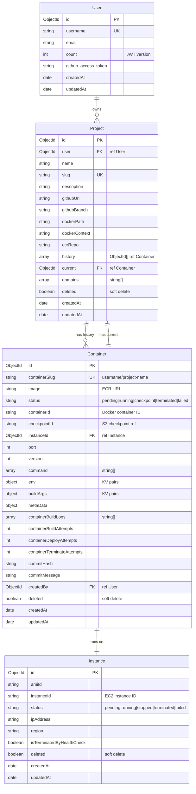

# Database Schema

## Entity Relationship Diagram



## Mongoose Models (Typegoose)

Models use **Typegoose** — a TypeScript decorator-based wrapper around Mongoose:

```typescript
// Example: Project model
@modelOptions({ schemaOptions: { timestamps: true } })
export class Project {
  @prop({ ref: () => User, required: true })
  user!: Ref<User>;

  @prop({ required: true })
  name!: string;

  @prop({ unique: true, required: true })
  slug!: string;

  @prop()
  description?: string;

  @prop({ required: true })
  githubUrl!: string;

  @prop()
  githubBranch?: string;

  @prop({ ref: () => Container })
  history?: Ref<Container>[];

  @prop({ ref: () => Container })
  current?: Ref<Container>;

  @prop({ type: () => [String], default: [] })
  domains?: string[];

  @prop({ default: false })
  deleted?: boolean;
}
```

## Indexes

| Collection | Index | Purpose |
|-----------|-------|---------|
| User | `username` (unique) | User lookup by username |
| Project | `slug` (unique) | URL-friendly project lookup |
| Container | `containerSlug` (unique) | `"username/project-name"` unique constraint |
| Container | `status` | Filter by status |
| Instance | `instanceId` | EC2 instance ID lookup |

## Soft Deletes

All models implement soft deletes via a `deleted: boolean` field. Queries automatically filter `{ deleted: { $ne: true } }` using a helper in `packages/backend/database/utils.ts`.
