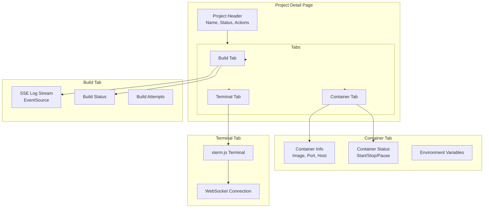

# Components & UI

## Component Architecture

```
components/
└── ui/                      # shadcn/ui primitives
    ├── button.tsx
    ├── card.tsx
    ├── dialog.tsx
    ├── dropdown-menu.tsx
    ├── form.tsx
    ├── input.tsx
    ├── select.tsx
    ├── badge.tsx
    ├── skeleton.tsx
    ├── toast.tsx
    ├── command.tsx           # cmdk-based command palette
    └── auto-complete.tsx     # GitHub repo/branch search
└── internal/                # App-specific components
    ├── common/
    │   ├── navbar.tsx        # Top navigation bar
    │   ├── theme-toggle.tsx  # Dark/light mode switch
    │   ├── logout-btn.tsx    # Logout button
    │   └── submit-btn.tsx    # Form submit with loading
    ├── forms/
    │   ├── general-form.tsx  # Generic form builder
    │   └── array-form.tsx    # Key-value array input
    ├── new/                  # New project wizard
    │   ├── general-details.tsx
    │   └── new-navlink.tsx
    ├── project/              # Project details
    │   ├── current.tsx       # Current deployment info
    │   ├── status.tsx        # Status badge
    │   ├── rollback.tsx      # Version rollback UI
    │   └── state-update-btn.tsx
    ├── tabs/                 # Project detail tabs
    │   ├── build-tab.tsx     # Build logs viewer (SSE)
    │   ├── container-tab.tsx # Container info
    │   ├── terminal-tab.tsx  # xterm.js SSH terminal
    │   └── loader-ui.tsx     # Loading skeleton
    ├── settings/
    │   ├── general-settings.tsx
    │   └── settings-navlink.tsx
    └── wrapper/
        ├── apollo.tsx        # Apollo Client provider
        ├── session.tsx       # NextAuth session provider
        └── theme.tsx         # next-themes provider
```

## Tab System

The project detail page uses a custom tab system for three views:



## State Management

The frontend does NOT use Redux or Zustand. State is managed through:

1. **Apollo Client cache** — GraphQL query results are cached and normalized
2. **React state** — `useState` / `useReducer` for local UI state
3. **Server Components** — Data fetched during SSR is passed as props
4. **Server Actions** — Mutations that revalidate and return fresh data
