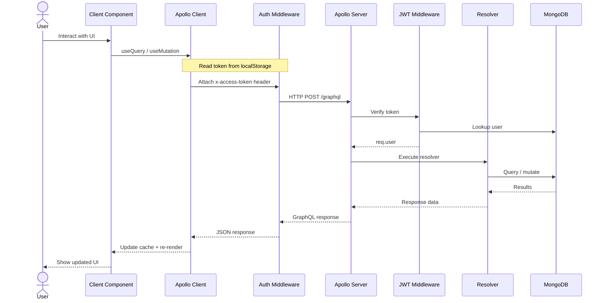
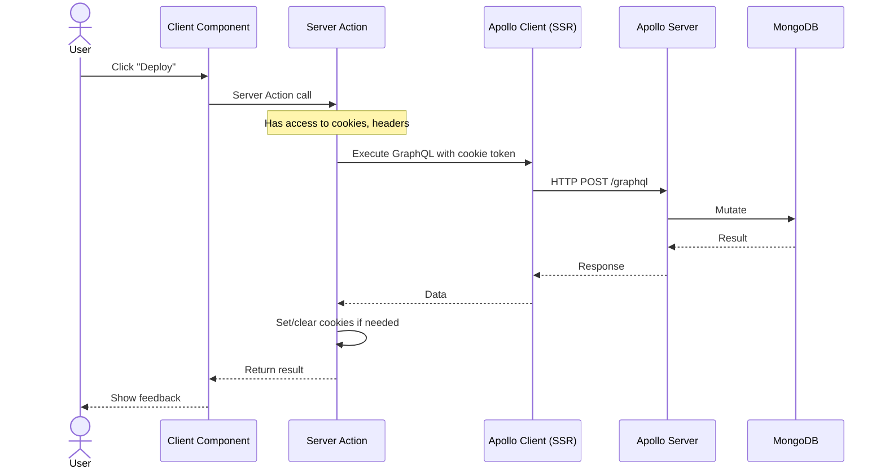
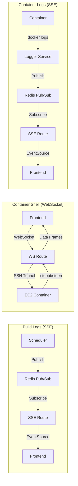

# Data Flow

## GraphQL API Call Flow

```mermaid
sequenceDiagram
    actor U as User
    participant C as Client Component
    participant A as Apollo Client
    participant MW as Auth Middleware
    participant API as Apollo Server
    participant JWT as JWT Middleware
    participant R as Resolver
    participant DB as MongoDB

    U->>C: Interact with UI
    C->>A: useQuery / useMutation
    
    Note over A,MW: Read token from localStorage
    A->>MW: Attach x-access-token header
    MW->>API: HTTP POST /graphql
    
    API->>JWT: Verify token
    JWT->>DB: Lookup user
    JWT-->>API: req.user
    
    API->>R: Execute resolver
    R->>DB: Query / mutate
    DB-->>R: Results
    R-->>API: Response data
    
    API-->>MW: GraphQL response
    MW-->>A: JSON response
    A-->>C: Update cache + re-render
    C-->>U: Show updated UI
```

## Server Action Flow

For auth and project operations that need cookie access:

```mermaid
sequenceDiagram
    actor U as User
    participant C as Client Component
    participant SA as Server Action
    participant A as Apollo Client (SSR)
    participant API as Apollo Server
    participant DB as MongoDB

    U->>C: Click "Deploy"
    C->>SA: Server Action call
    
    Note over SA: Has access to cookies, headers
    
    SA->>A: Execute GraphQL with cookie token
    A->>API: HTTP POST /graphql
    
    API->>DB: Mutate
    DB-->>API: Result
    
    API-->>A: Response
    A-->>SA: Data
    SA->>SA: Set/clear cookies if needed
    SA-->>C: Return result
    C-->>U: Show feedback
```

## Real-time Data Flow

```mermaid
graph LR
    subgraph "Build Logs (SSE)"
        Sched[Scheduler] -->|Publish| RP[Redis Pub/Sub]
        RP -->|Subscribe| SSE[SSE Route]
        SSE -->|EventSource| FE[Frontend]
    end
    
    subgraph "Container Shell (WebSocket)"
        FE2[Frontend] -->|WebSocket| WS[WS Route]
        WS -->|SSH Tunnel| EC2[EC2 Container]
        EC2 -->|stdout/stderr| WS
        WS -->|Data Frames| FE2
    end
    
    subgraph "Container Logs (SSE)"
        C[Container] -->|docker logs| L[Logger Service]
        L -->|Publish| RP2[Redis Pub/Sub]
        RP2 -->|Subscribe| SSE2[SSE Route]
        SSE2 -->|EventSource| FE3[Frontend]
    end
```
