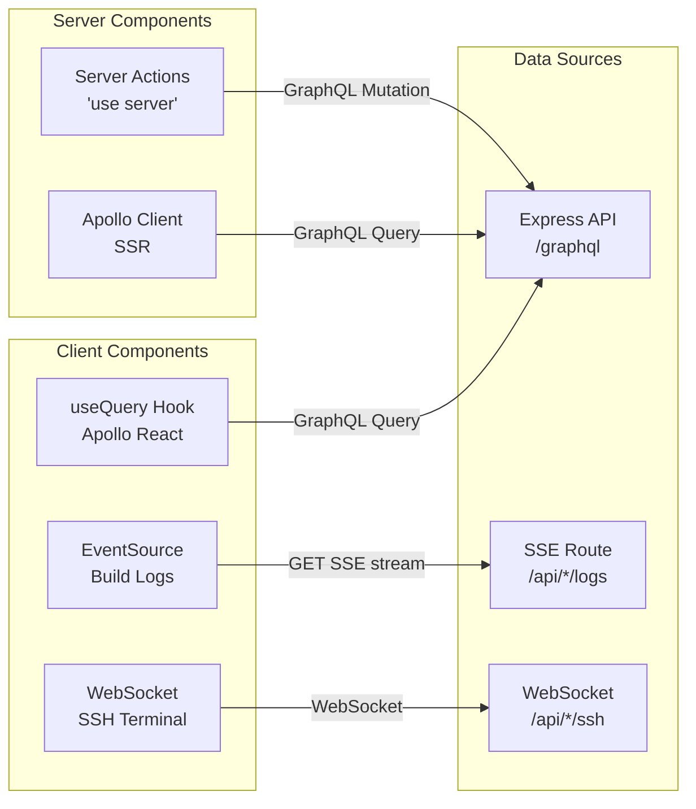

# Routing & Data Flow

## App Router Layouts

Next.js 14 App Router provides nested layouts with persistent state:

```mermaid
graph TB
    subgraph "Root Layout (app/layout.tsx)"
        HTML[<html>]
        Body[<body>]
        TP[ThemeProvider<br/>next-themes]
        SP[SessionProvider<br/>NextAuth]
        AP[ApolloProvider<br/>client]
    end
    
    subgraph "App Layout (app/(app)/layout.tsx)"
        NB[Navbar]
        Content[children]
    end
    
    subgraph "Pages"
        Home[(app)/page.tsx]
        New[(app)/new/page.tsx]
        Projects[(app)/projects/page.tsx]
        Settings[(app)/settings/page.tsx]
        Project[(app)/project/[username]/page.tsx]
    end
    
    HTML --> Body
    Body --> TP
    TP --> SP
    SP --> AP
    
    AP --> NB
    NB --> Content
    Content --> Home
    Content --> New
    Content --> Projects
    Content --> Settings
    Content --> Project
```

## Data Fetching Strategy



## GraphQL Codegen

TypeScript types are auto-generated from `.graphql` documents:

- **Server types**: `codegen-server.yml` → `packages/types/graphql-server.ts`
- **Client types**: `codegen-client.yml` → `frontend/src/graphql-client.ts`

All queries and mutations are defined in `.graphql` files co-located with their components, then codegen produces typed React hooks.
