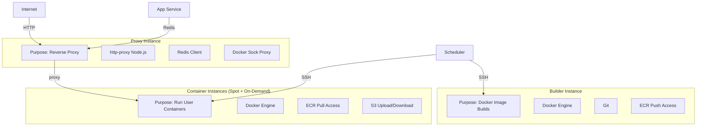
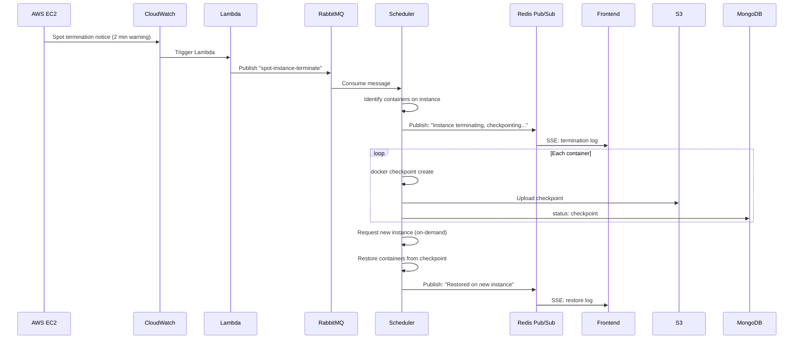

# EC2 Instances

## Instance Architecture

Two types of EC2 instances are used:

## Builder Instance

- **Type**: c5.xlarge (or configured via constants)
- **AMI**: Custom AMI with Docker pre-installed
- **Role**: IAM role with ECR push access
- **Lock**: Redlock ensures one build at a time

## Container Instances

- **Type**: Spot instances (with on-demand fallback)
- **AMI**: Same custom AMI as builder
- **Role**: IAM role with ECR pull + S3 access
- **Lifecycle**: Created/destroyed dynamically by the Scheduler
- **Spot handling**: Termination notice → CloudWatch → Lambda → RabbitMQ → Scheduler checkpoint

## Spot Instance Termination Flow

