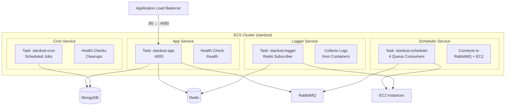

# ECS Fargate Services

## Service Definitions

Four Fargate services run the backend microservices.



## Task Configuration

| Service | CPU | Memory | Desired Count |
|---------|-----|--------|---------------|
| App | 512 | 1024 | 2 (HA) |
| Scheduler | 256 | 512 | 1 |
| Cron | 128 | 256 | 1 |
| Logger | 128 | 256 | 1 |

## Image Build

Docker images are built and pushed to ECR as part of the Pulumi deployment (`infra/resource/image.ts`):

```dockerfile
# Dockerfile.app
FROM node:20-slim
WORKDIR /app
COPY dist/backend.js .
COPY node_modules node_modules
EXPOSE 4000
CMD ["node", "backend.js"]
```
