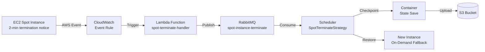
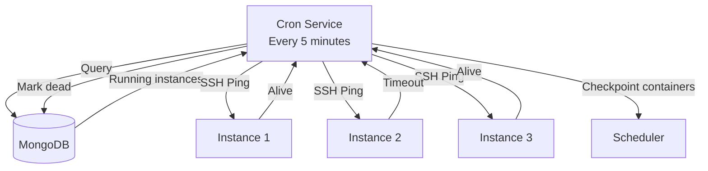

# Eventing & Monitoring

## Spot Instance Termination Pipeline

## Lambda Handler

Two versions exist:
- **JavaScript** at `lambda/index.js` (deployed to AWS)
- **TypeScript** at `packages/lambda/index.ts` (bundled with esbuild)

The Lambda:
1. Receives the CloudWatch event with instance ID
2. Looks up the instance in SSM Parameter Store
3. Publishes a message to the `spot-instance-terminate` RabbitMQ queue
4. Returns success

## Health Check Flow

## Cleanup Jobs

| Job | Frequency | Action |
|-----|-----------|--------|
| Container cleanup | 1 hour | Remove terminated containers > 24h old |
| Instance cleanup | 1 hour | Terminate unused instances |
| Checkpoint cleanup | 1 hour | Remove expired checkpoints from S3 |
