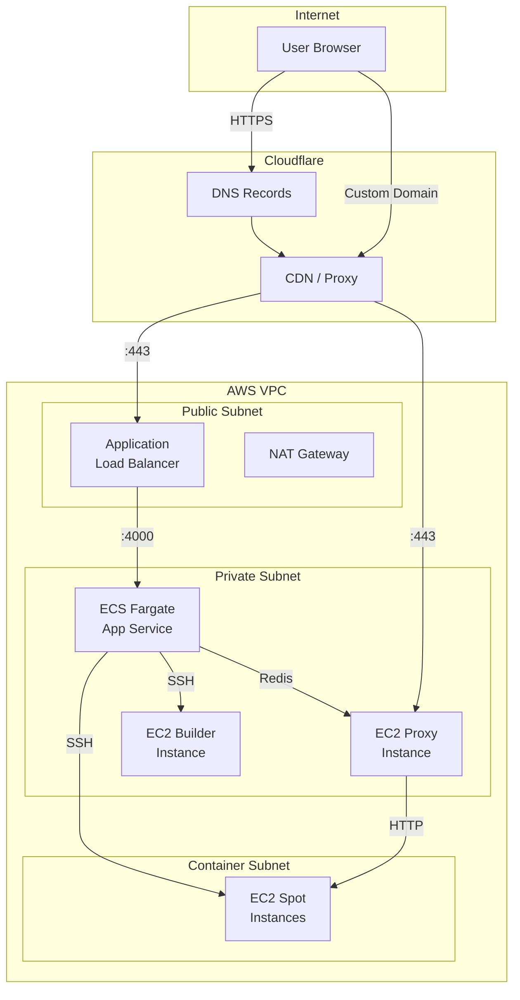

# Networking & DNS

## Network Architecture

## Security Groups

| Group | Rules |
|-------|-------|
| ALB SG | Inbound: 443 (HTTPS), Outbound: 4000 to ECS |
| EC2 SG | Inbound: 22 (SSH) from ECS, Outbound: all |
| ECS SG | Inbound: 4000 from ALB, Outbound: all |

## Cloudflare DNS

Records managed via Pulumi (`infra/resource/cloudflare.ts`):

| Type | Name | Target |
|------|------|--------|
| A | `@` | ALB DNS |
| A | `www` | ALB DNS |
| CNAME | `*` | Proxy instance (wildcard for user subdomains) |
