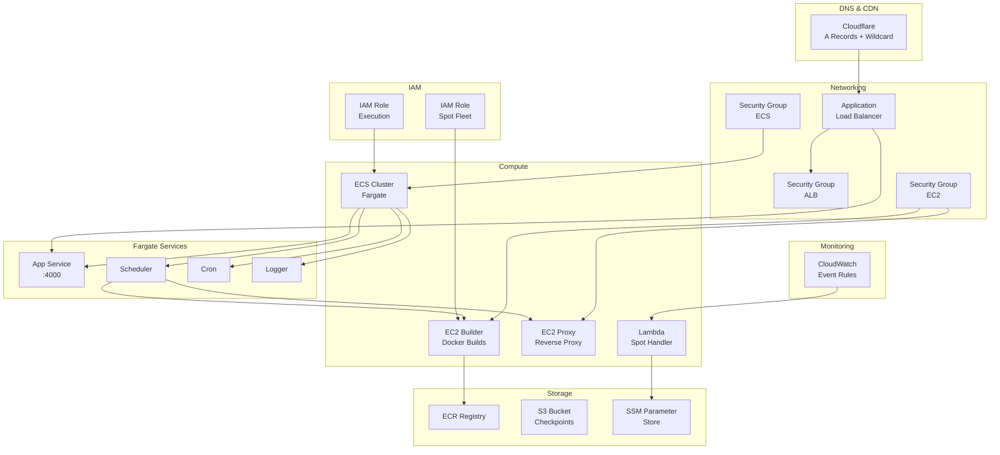

# Infrastructure Overview

## Stack

All infrastructure is provisioned via **Pulumi v3** using `@pulumi/aws` and `@pulumi/cloudflare`.

```
infra/
├── index.ts                # Stack composition
├── Pulumi.yaml
├── Pulumi.dev.yaml
├── resource/
│   ├── alb.ts              # Application Load Balancer
│   ├── ami.ts              # Custom AMI from EC2 instance
│   ├── cloudflare.ts       # DNS records
│   ├── cloudwatch.ts       # Event rules
│   ├── ecr.ts              # Docker image registry
│   ├── ecs.ts              # ECS cluster
│   ├── fargate.ts          # Fargate service definitions
│   ├── image.ts            # Docker image build + push
│   ├── instance.ts         # EC2 builder/proxy instances
│   ├── keystore.ts         # SSH keys, Docker passwords
│   ├── lambda.ts           # Spot termination handler
│   ├── proxy.ts            # Reverse proxy setup
│   ├── region.ts           # Region configuration
│   ├── role.ts             # IAM roles
│   ├── s3.ts               # S3 buckets
│   ├── securityGroup.ts    # Security groups
│   ├── ssh.ts              # SSH command helpers
│   └── ssm.ts              # SSM Parameter Store
├── docker/
│   ├── compose.yml         # Local dev Docker Compose
│   ├── Dockerfile.app      # App service Docker image
│   └── Dockerfile.logger   # Logger service Docker image
├── scripts/
└── utils/
```

## Resource Diagram



## Provisioned Resources

| Resource | Type | Purpose |
|----------|------|---------|
| EC2 Builder | `aws.ec2.Instance` | Docker image building |
| EC2 Proxy | `aws.ec2.Instance` | Reverse proxy to containers |
| AMI | `aws.ami.FromInstance` | Custom AMI snapshot |
| ECS Cluster | `aws.ecs.Cluster` | Fargate service host |
| Fargate: App | `aws.ecs.Service` | Express + Apollo API |
| Fargate: Scheduler | `aws.ecs.Service` | Queue consumers |
| Fargate: Cron | `aws.ecs.Service` | Scheduled tasks |
| Fargate: Logger | `aws.ecs.Service` | Log collector |
| ECR | `aws.ecr.Repository` | Docker image storage |
| S3 | `aws.s3.Bucket` | Container checkpoints |
| ALB | `aws.lb.LoadBalancer` | HTTP routing to Fargate |
| Lambda | `aws.lambda.Function` | Spot termination handler |
| CloudWatch | `aws.cloudwatch.EventRule` | Spot termination notification |
| SSM | `aws.ssm.Parameter` | Secrets and config |
| Cloudflare | `cloudflare.Record` | DNS management |
