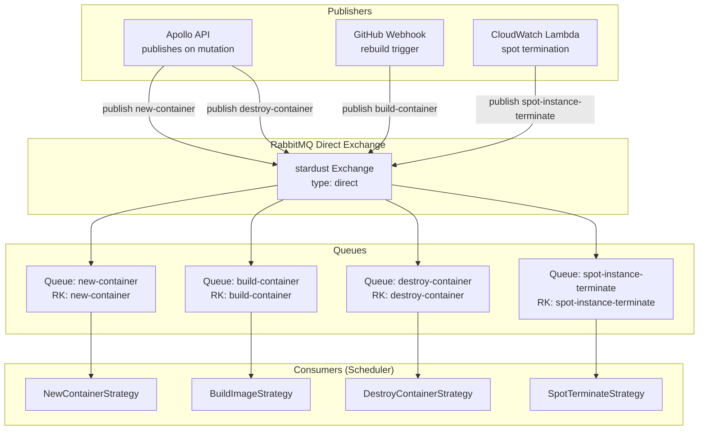

# RabbitMQ Messaging

## Queue Architecture

RabbitMQ provides async job processing with a **direct exchange** and **four queues**.



## Queue Details

| Queue | Consumer | Max Retries | Visibility Timeout |
|-------|----------|-------------|-------------------|
| `new-container` | NewContainerStrategy | 3 | 30 min |
| `build-container` | BuildImageStrategy | 3 | 30 min |
| `destroy-container` | DestroyContainerStrategy | 2 | 5 min |
| `spot-instance-terminate` | SpotTerminateStrategy | 1 | 10 min |

## Message Payload

Messages are validated with Zod schemas:

```typescript
// Example: new-container message
{
  containerId: "abc123",
  projectId: "proj_456",
  userId: "user_789",
  timestamp: "2024-01-01T00:00:00Z"
}
```

## Queue Module

Located in `packages/core/queue.ts`. Manages:

- Connection setup (amqplib)
- Channel creation
- Exchange declaration (direct)
- Queue binding with routing keys
- Message publishing
- Consumer setup with retry logic
