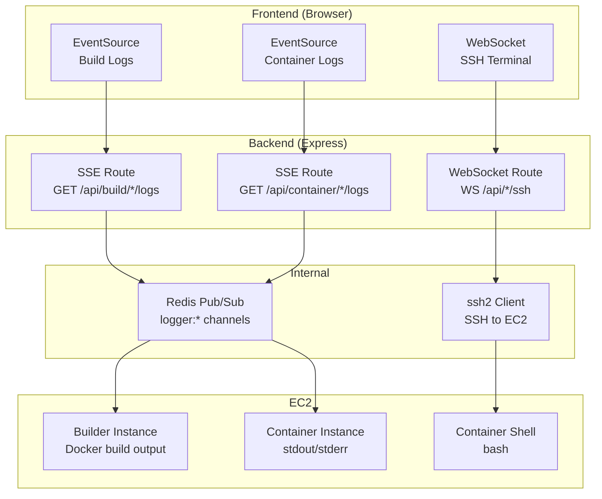
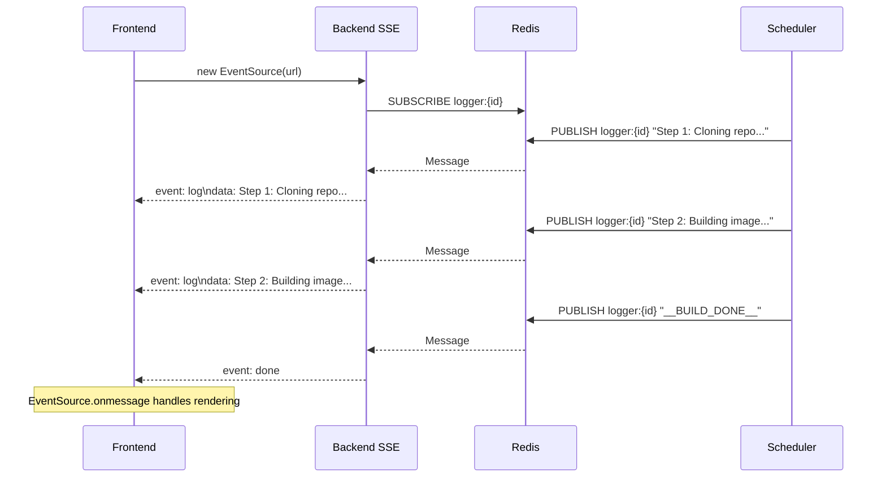
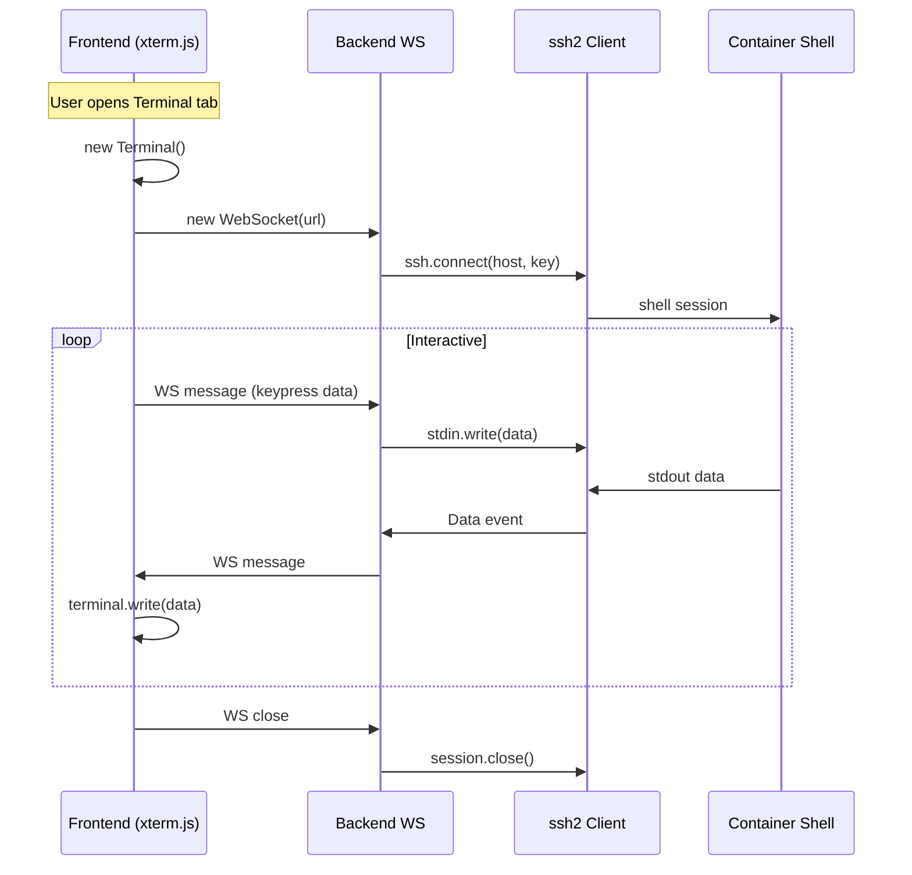

# Real-time Systems

## Overview

Three real-time mechanisms provide live interaction:

| Mechanism | Protocol | Use Case |
|-----------|----------|----------|
| SSE | HTTP EventSource | Build logs, container logs |
| WebSocket | WS | SSH terminal into containers |
| Redis Pub/Sub | TCP | Internal event distribution |

## Architecture

## SSE Log Streaming Flow

## WebSocket SSH Flow

