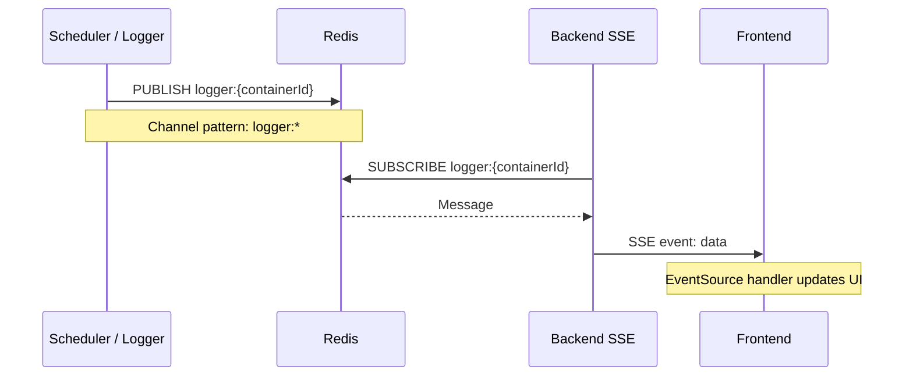
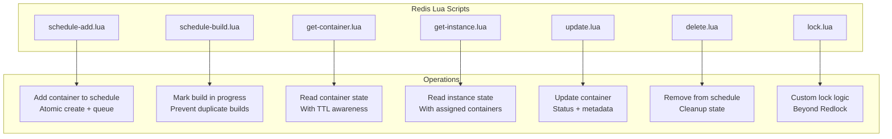

# Redis

## Usage Overview

Redis serves multiple roles in the architecture:

| Role | Mechanism | Details |
|------|-----------|---------|
| Pub/Sub (Logs) | `PUBLISH/SUBSCRIBE` | Real-time log streaming to SSE endpoints |
| Distributed Locks | Redlock | Builder and instance allocation coordination |
| Container State | Lua Scripts | Atomic scheduling state management |
| Proxy Routing | Key-Value | Container host:port mappings for reverse proxy |

## Pub/Sub for Log Streaming



## Distributed Locking (Redlock)

Two lock resources are used:

1. **Builder Lock** — `lock:builder:{region}` — Ensures only one Docker build runs at a time on the builder EC2
2. **Instance Lock** — `lock:instance:{instanceId}` — Ensures atomic container-to-instance assignment

```typescript
const lock = await redlock.acquire(['lock:builder:us-east-1'], 300000); // 5 min TTL
try {
  // Run docker build
} finally {
  await lock.release();
}
```

## Lua Scripts for Atomic Operations



## Lua Script Runner

Scripts are loaded and executed via the `runLuaScript` helper:

```typescript
// packs/core/redis.ts loads scripts and provides:
async function runLuaScript(name: string, keys: string[], args: string[]) {
  // EVALSHA with fallback to EVAL
}
```
