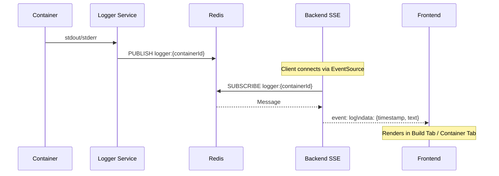

# Logger Service

## Overview

The Logger service collects and distributes container logs in real-time via Redis pub/sub.

## Architecture

```
Container (stdout/stderr)
       │
       │ docker logs
       ▼
   Logger Service
       │
       │ PUBLISH logger:{containerId}
       ▼
   Redis Pub/Sub
       │
       ├──► SSE Route (backend)
       │        │ EventSource
       │        ▼
       │    Frontend
       │
       └──► Scheduler
                │
                ▼
            MongoDB (persisted)
```

## Log Flow


