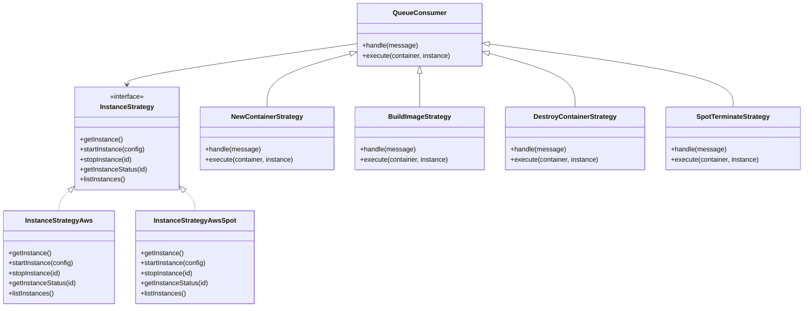
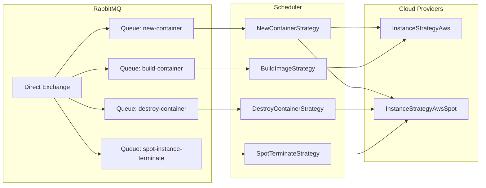

# Scheduler Service

## Overview

The **Scheduler** is a microservice that consumes RabbitMQ queues and executes container operations. It uses the **Strategy pattern** to support different cloud providers.

## Architecture

```
packages/scheduler/
├── index.ts                    # Entry: sets up 4 queue consumers
├── container/
│   ├── index.ts                # Queue consumer setup, strategy routing
│   └── controllers/
│       ├── new-container.ts    # Strategy: deploy new container
│       ├── build-image.ts      # Strategy: build Docker image
│       ├── destroy-container.ts # Strategy: destroy container
│       └── spot-terminate.ts   # Strategy: handle spot termination
├── library/
│   ├── instance.ts             # Abstract strategy interface
│   ├── instance.aws.ts         # AWS on-demand implementation
│   └── instance.aws.spot.ts    # AWS spot implementation
└── lua/                        # Redis Lua scripts
```

## Strategy Pattern



## Queue Consumer Setup



## Strategy: New Container

1. Receive message from `new-container` queue
2. Select available instance (via `InstanceStrategy`)
3. If no instance available, create one
4. Lock the builder instance (Redlock)
5. SSH into builder: `git clone`, `docker build`, `docker push` to ECR
6. Release builder lock
7. SSH into target instance: `docker pull`, `docker run`
8. Update MongoDB container status to `running`
9. Publish logs via Redis pub/sub

## Strategy: Build Image

Similar to new-container but only builds the Docker image without deploying. Used for webhook-triggered rebuilds.

## Strategy: Destroy Container

1. SSH into the instance hosting the container
2. `docker stop` + `docker rm`
3. Optionally create a checkpoint and upload to S3
4. Remove from reverse proxy
5. Update MongoDB status to `terminated`
6. Clean up instance if no more containers

## Strategy: Spot Terminate

Triggered by CloudWatch → Lambda → RabbitMQ when a spot instance receives a termination notice:

1. Identify all containers on the terminating instance
2. For each container: create checkpoint → upload to S3
3. Update MongoDB status to `checkpoint`
4. Request new instance via `InstanceStrategy`
5. Restore containers from checkpoints on new instance
