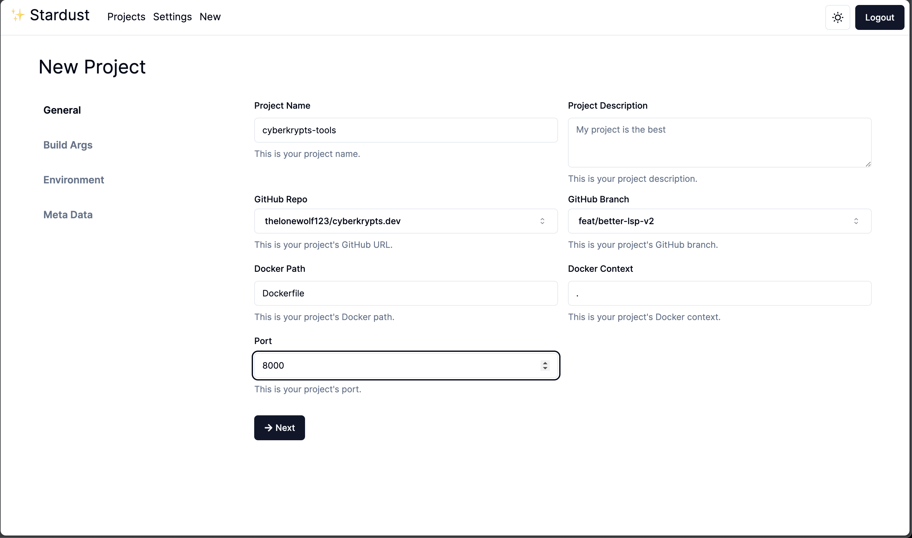
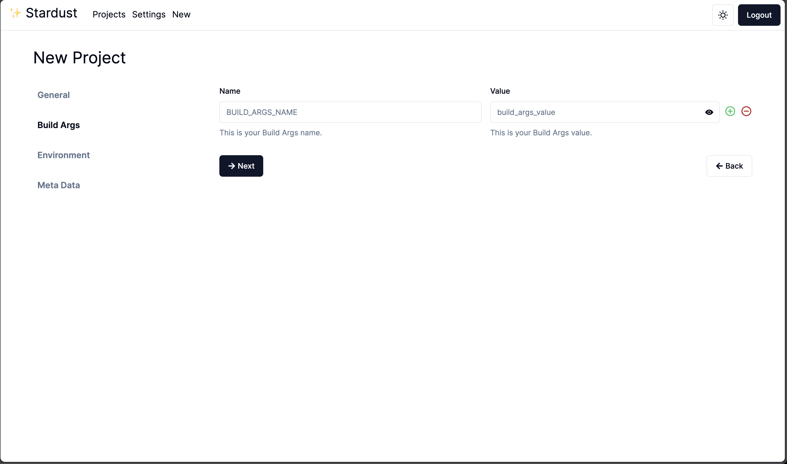
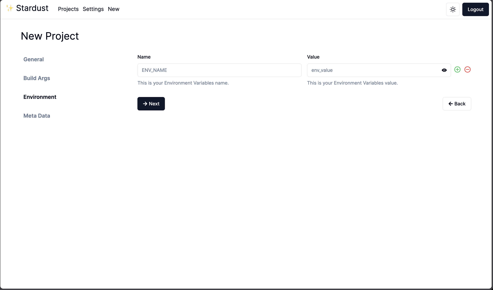
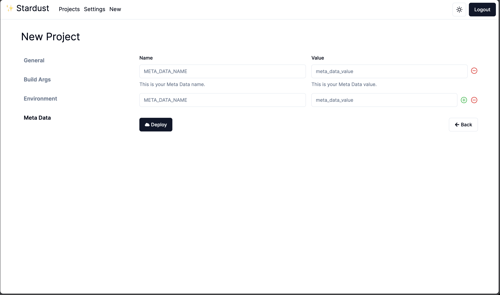
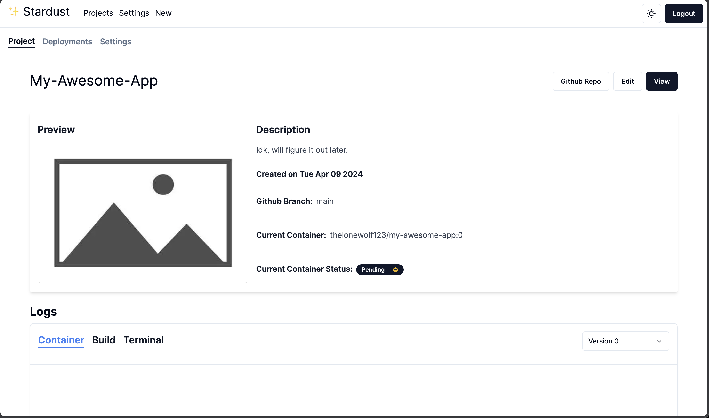
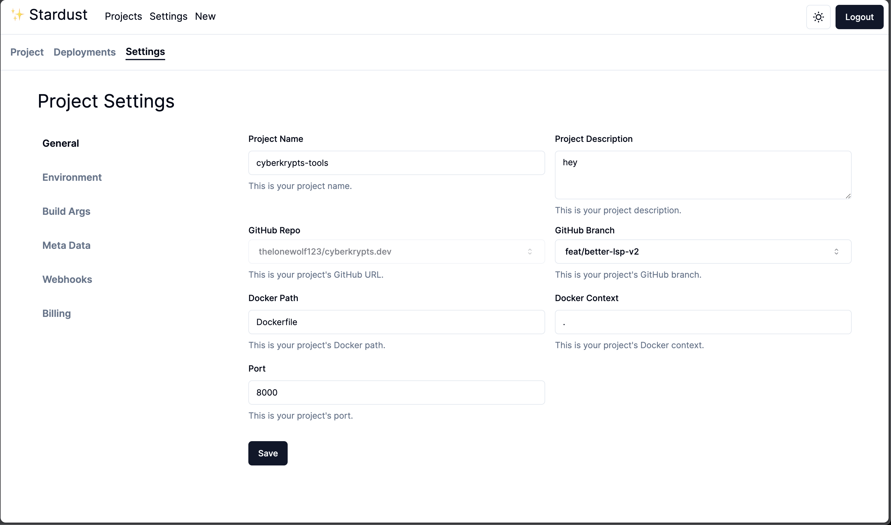
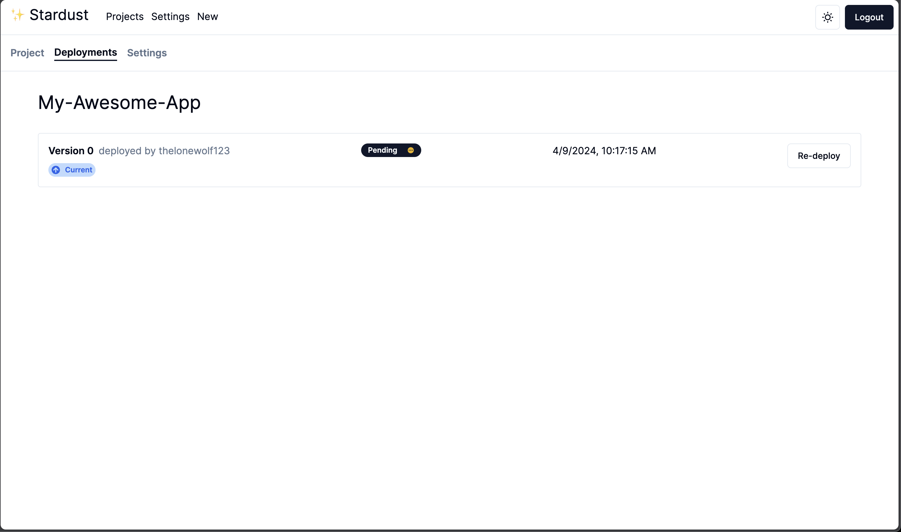

# Stardust.app: container provision engine

Stardust.app is a powerful container provision engine built with Node.js, TypeScript, MongoDB, Redis and Pulumi. It allows you to easily manage and orchestrate containers in your infrastructure, providing a seamless experience for containerized applications.

**Note**: Stardust.app is a proof of concept (PoC) and is not recommended for production use. It's a PoC platform to deploy containers on spot instances in AWS.

## Features

-   **Easy to use**: Stardust.app is built with simplicity in mind. It's easy to use and easy to deploy.
-   **Scalable**: Stardust.app is built to scale. It can handle thousands of containers with ease.
-   **Secure**: Stardust.app is built with security in mind. It uses the latest security standards and best practices.
-   **Open source**: Stardust.app is open source and free to use. You can contribute to the project and make it better.

## Preview

Here are some screenshots of the Stardust.app:

|            Step 1            |            Step 2            |
| :--------------------------: | :--------------------------: |
|  |  |

|            Step 3            |            Step 4            |
| :--------------------------: | :--------------------------: |
|  |  |

|            Project             |             Settings             |
| :----------------------------: | :------------------------------: |
|  |  |

|              Deployment              |
| :----------------------------------: |
|  |
